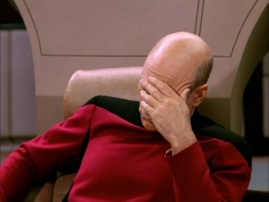

#Инструкция для работы Markdown

## Выделение текста

Чтобы выделить текст курсивом необходимо обрамить его звездочками (*). Например, *вот так*. 
или 
_вот так_. 

Чтобы выделить те

кст полужирным, необходимо обрамить его двойными звездочками (**)
Например, **вот так**.
__вот так__ 

альтернативные способы выделения текста нужны для того чтобы мы могли совмещать выделения текста.
Например вот так 

_Пример комбинации способов **Выделения**_

## Списки

Нумерованные списки 
1. номер один
2. номер два

Не нумерованные списки

* Раз
* два
* три 

Попытка сделать конфликт 

## Работа с изображениями
Изображения добавляются при помощи конструкции **
Например 

Чтобы вставить изображение в текст, достаточно написать следующее 

## Ссылки
Чтобы вставить изображение в текст, достаточно написать следующее 

[ссылка ](https://example.com)

## работа с таблицами

## Работа удаленным репозиторием

git clone <url репозитория>

## Цитаты

## Заключение 